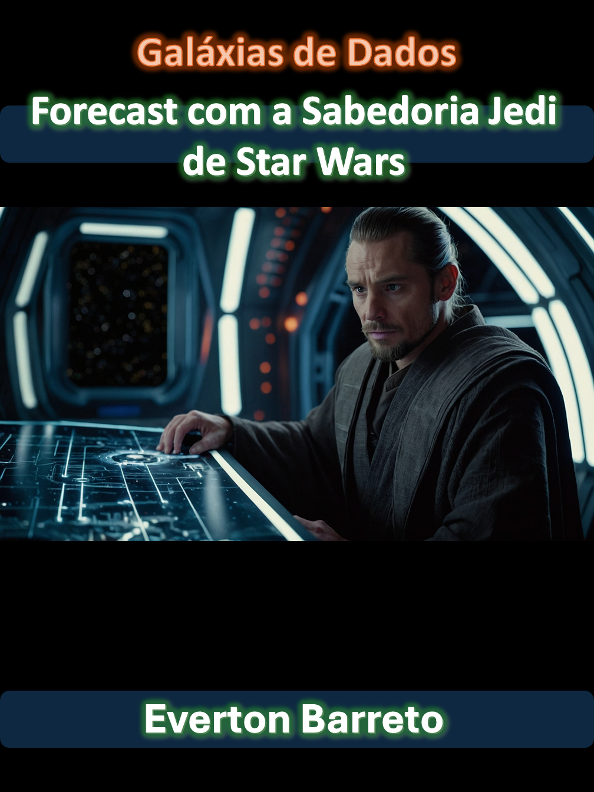

    

-------

# Projeto EBOOK Gerado por I.A.s

 > ℹ️ **NOTE:** Este é o repositório desenvolvido durante o curso no qual fui instrutor técnico na plataforma da [DIO](https://dio.me)

Projeto com o objetivo de gerar um ebook digital com as facilidades das ferramentas de IA. todos os prompts
seguem abaixo.

<a href="https://github.com/jevertonbs/prompts-recipe-to-create-a-ebook/blob/502325a056463f38200a5e612f4a21aa77639027/output/ebook%20forecast.pdf" title="View PDF now"> 📕Clique aqui para ler</a>

## 💻 Tecnologias utilizadas no projeto

- [ChatGPT](https://chat.openai.com/) 
- [MidJourney](https://www.midjourney.com/app/)
- [PowerPoint](https://www.microsoft.com/en/microsoft-365/powerpoint)

## 🧠 Prompts

ChatGPT：

|   Ação   | prompt                                                                                                                                                                                                                                                                         |
| :------: | ------------------------------------------------------------------------------------------------------------------------------------------------------------------------------------------------------------------------------------------------------------------------------ |
|  título  | Crie 5 sugestões criativas para o título do ebook com o tema star wars|
| conteúdo | Faça um texto para ebook, com foco em forecast, liste os principais modelos de aprendizagem utilizados para realizar forecast e suas melhores práticas. Regras: Explique sempre de uma maneira muito simples; Utilize textos curtos; Sempre traga exemplos de casos de uso real; Sempre deixe um título sugestivo por tópico. |

Midjourney：

|  Ação  | prompt                                                                                 |
| :----: | -------------------------------------------------------------------------------------- |
| título | A jedi in spacial station, look for the forecast graphic in the ultrarealistc painel, in the background a space and stars in the window of the spaceship, ultrarealistc image --v 5.1 |

## ✨ Features

- Conteúdo gerado via ChatGPT
- Imagens geradas via MidJourney

## 📚 Materiais

- Imagens utilizadas em `assets`
- ebook gerado durante as aulas em `output`

## 🛠️ Instruções de execução

Utilize os prompts acima nas ferramentas sugeridas para gerar o material base e utilize uma ferramenta de edição de documentos como power point, libreoffice , indesign para diagramação.

## 👨‍💻 Expert

    
    
&nbsp&nbsp&nbspEverton Barreto 
    &nbsp&nbsp&nbsp
    <a href="www.linkedin.com/in/
everton-barreto">
    LinkedIn</a>&nbsp;

  

---

⌨️ com 💜 por [Felipe Aguiar](https://github.com/felipeAguiarCode)
